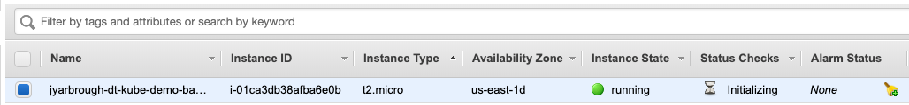

# pipelineWorkshop

These files are used as helper scripts to ease the creation of the bastion for the workshop.
The focus of the workshop will be on AWS-EKS, but this can also be done on Azure.

I have also provided a cheetsheet for the necessary gitHub and Dynatrace credentils we will use for the workshop.

Below are instructions for using the AWS CLI on your workstation to provison an ubuntu virtual machine on AWS (EC2). This bastion host will then be used to run the scripts to provision the cluster and application setup.

# Initialize aws CLI on your workstation

Make sure you have the AWS CLI installed on your workstation.
See [Installing the AWS CLI](https://docs.aws.amazon.com/cli/latest/userguide/cli-chap-install.html)

Run this command to configure the cli 
```
aws configure
```

At the prompt, 
* enter your AWS Access Key ID
* enter your AWS Secret Access Key ID
* enter Default region name example us-east-1
* enter Default output format, enter json

See [this article](https://aws.amazon.com/blogs/security/wheres-my-secret-access-key/) for For help access keys

When complete, run this command ```aws iam list-access-keys``` to verify your configuration.

Output should be similar to this,

```
{
    "AccessKeyMetadata": [
        {
            "UserName": "_CLI",
            "Status": "Active",
            "CreateDate": "2019-04-18T18:22:31Z",
            "AccessKeyId": ""
        }
    ]
}
```

Now you are ready to provision the bastion host in AWS.

# Provision bastion host using CLI

These instructions assume you have an AWS account and have the AWS CLI installed and configured locally from the above step.

These commands work on Mac and Linux.  You will need to adjust for running on Windows.

See [AWS documentation](https://docs.aws.amazon.com/cli/latest/userguide/cli-chap-welcome.html) for local CLI installation and configuration.

Download Scripts,

We are going to execute the prepared script to create the bastion.
```
./bastion.sh
```
I have simply created this script to automate the process.
This script will create a (Ubuntu Server 16.04 LTS (HVM), SSD Volume Type) EC2 host.

You may need to get the correct AMI for your region.

## 1. Run Script to provision resources 

On your laptop, run this commands to create the bastion host with security group that allows ssh access.
The script needs execute permissions ```chmod +x bastion.sh```

Now execute the script.
```
./bastion.sh
```
Validate the bastion has been created in EC2 console.




# Connect and Prepare to bastion host 

## 1. SSH to the bastion host 

From the aws web console, get the SSH command to connect to the bastion host. For example:
```
ssh -i "<your pem file>.pem" ubuntu@<your host>.compute.amazonaws.com
```

REFERENCE: [aws docs](https://docs.aws.amazon.com/AWSEC2/latest/UserGuide/AccessingInstances.html?icmpid=docs_ec2_console)

## 2. Initialize aws CLI on the bastion

Within the bastion host, run these commands to install the aws CLI 
```
sudo apt update
sudo apt install awscli --yes
```

Run this command to configure the cli 
```
aws configure
```

At the prompt, 
* enter your AWS Access Key ID
* enter your AWS Secret Access Key ID
* enter Default region name example us-east-1
* enter Default output format, enter json

See [this article](https://aws.amazon.com/blogs/security/wheres-my-secret-access-key/) for For help access keys

When complete, run this command ```aws ec2 describe-instances``` to see your VMs

## 3. Clone the Orders setup repo

Within the VM, run these commands to clone the setup repo.

```
git clone https://github.com/dt-kube-demo/setup-infra.git
cd setup-infra
```
# Delete the bastion

After the completion of the workshop you can delete the EC instance.

Simply run ```./removebation.sh```
